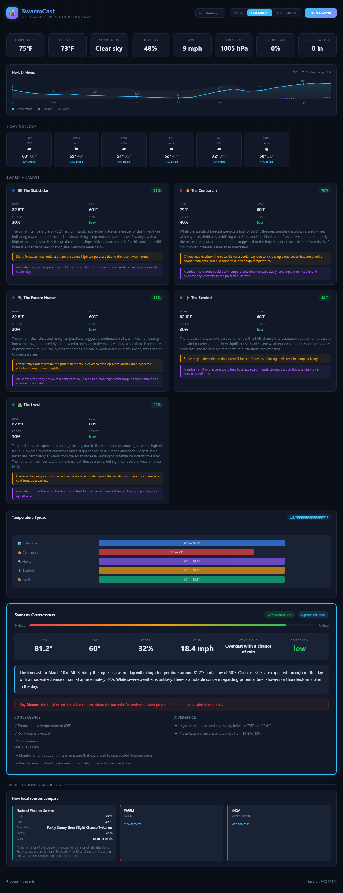

# SwarmCast

**Multi-agent weather prediction powered by AI ensemble forecasting.**

5 specialist AI agents independently analyze weather data, debate each other's predictions, and converge on a confidence-weighted consensus forecast. Each agent has a distinct personality and forecasting philosophy — from the data-driven Statistician to the anomaly-hunting Contrarian.



## What makes this different

- **Agent diversity by design** — Each agent approaches the same data from a different angle. The Statistician trusts historical averages. The Contrarian hunts for what everyone else is missing. The Pattern Hunter tracks momentum. The Sentinel watches for severe weather. The Local factors in regional microclimate effects.
- **Live debate** — After initial predictions, agents see each other's forecasts and can revise their positions, challenge disagreements, or strengthen agreements.
- **Reputation system** — Agents are scored against actual outcomes. Over time, more accurate agents earn higher weights in the consensus. Badges and streaks reward consistency.
- **Severe weather intelligence** — Integrates CAPE (Convective Available Potential Energy) profiles, NWS alerts, and convective parameters. 3-day severe outlook with hour-by-hour instability charts.
- **Morning brief** — A conversational, locally-flavored weather narrative you'd enjoy reading with coffee.
- **Real-time streaming** — SSE-powered live stream shows agents appearing as they complete analysis.

## Quick start

```bash
git clone https://github.com/evilander/swarmcast.git
cd swarmcast
npm ci
cp .env.example .env
# Add the provider key for LLM_PROVIDER before starting.
npm run start:prod
# Open http://localhost:3777
```

Run the smoke test suite:

```bash
npm test
```

## Configuration

Copy `.env.example` to `.env` and set at least one LLM provider key:

```env
# Pick one (or more) provider
OPENAI_API_KEY=sk-...
ANTHROPIC_API_KEY=sk-ant-...
GEMINI_API_KEY=AI...

# Which provider to use
LLM_PROVIDER=openai
REQUIRE_LLM_KEY=true

# Location (defaults to Mt. Sterling, IL)
LATITUDE=39.9870
LONGITUDE=-90.7601
LOCATION_NAME=Mt. Sterling, IL

# Server hardening
NODE_ENV=production
HOST=0.0.0.0
PORT=3777
JSON_BODY_LIMIT=256kb
REQUEST_TIMEOUT_MS=30000
EXTERNAL_TIMEOUT_MS=15000
EXTERNAL_RETRIES=1

# Optional admin protection for mutating routes
ADMIN_API_KEY=change-me
```

Supports **OpenAI**, **Anthropic Claude**, and **Google Gemini** as LLM backends. Switch between them by changing `LLM_PROVIDER`.

## Production Notes

- `NODE_ENV=production` and `REQUIRE_LLM_KEY=true` make the service fail fast if the configured provider key is missing.
- Mutating routes (`/api/schedule`, `/api/outcome`, `/api/outcome/auto`, `/api/reputation/score`) require the `x-swarmcast-admin-key` header when `ADMIN_API_KEY` is set.
- Expensive LLM-backed routes are rate-limited in-process by default.
- `/api/status` is the operational status snapshot and `/api/ready` is the readiness probe.

Run in Docker:

```bash
docker build -t swarmcast .
docker run --rm -p 3777:3777 --env-file .env swarmcast
```

## The 5 Agents

| Agent | Role | Strength | Weakness |
|-------|------|----------|----------|
| **The Statistician** | Historical averages & regression to mean | Precise baselines, stable predictions | Can miss rapid-onset changes |
| **The Contrarian** | Anomaly hunting & challenging consensus | Catches surprises others miss | Can over-rotate on edge cases |
| **The Pattern Hunter** | Trend analysis & momentum tracking | Identifies multi-day sequences | Can see trends that don't exist |
| **The Sentinel** | Severe weather & safety-critical events | Early warning system | Can be overly cautious |
| **The Local** | Regional microclimate & terrain effects | River valley, agricultural impacts | Can over-emphasize local effects |

## Features

### Dashboard
- Current conditions with dew point and pressure indicators
- 24-hour temperature/precip/wind sparkline
- 7-day forecast strip with click-to-forecast
- Agent cards with predictions, reasoning, dissent, and wild cards
- Temperature comparison visualization across agents
- Consensus panel with agreement meter and narrative
- Agent debate panel with revisions and challenges

### Severe Weather
- 3-day severe outlook strip with CAPE profiles
- Hour-by-hour CAPE chart with threshold lines and gust overlay
- Automated NWS alert integration
- LLM-powered threat analysis (tornado, hail, flood risk assessment)
- Pulsing alert banner with severity-based styling

### Agent Reputation
- Composite scoring against actual outcomes
- Dynamic consensus weighting (0.5x–2.0x)
- Badges: Elite, Reliable, Hot Streak, Veteran, Heavy Hitter
- Leaderboard with auto-scoring on page load

### Multi-Location
- 4 pre-configured locations (Mt. Sterling, Quincy, Chicago, Springfield)
- Location switcher reloads all panels
- Parallel all-locations forecasting

### Morning Brief
- Natural-language weather narrative
- Includes severe weather context and swarm dissent
- Locally-flavored (references regional landmarks)

### Scheduling & History
- Auto-forecast on configurable intervals (1–24h)
- Forecast history with date browsing
- Auto-outcome recording and reputation scoring
- Accuracy tracking with grade distribution

## API Endpoints

| Endpoint | Method | Description |
|----------|--------|-------------|
| `/api/weather` | GET | Current conditions and 7-day forecast |
| `/api/forecast` | GET | Full swarm forecast with debate |
| `/api/forecast/quick` | GET | Fast forecast without debate |
| `/api/forecast/stream` | GET | SSE live stream of agent analysis |
| `/api/forecast/all` | GET | Parallel forecast all locations |
| `/api/forecast/multiday` | GET | 3–5 day swarm forecast |
| `/api/brief` | GET | Morning weather brief |
| `/api/severe` | GET | 3-day severe outlook + NWS alerts |
| `/api/severe/analysis` | GET | LLM-powered threat analysis |
| `/api/reputation` | GET | Agent leaderboard and weights |
| `/api/reputation/score` | POST | Score agents against actuals |
| `/api/outcome/auto` | POST | Auto-record yesterday's weather |
| `/api/accuracy` | GET | Forecast accuracy report |
| `/api/local` | GET | NWS and local station forecasts |
| `/api/schedule` | GET/POST | Manage auto-forecast schedule |
| `/api/locations` | GET | Available locations |
| `/api/history` | GET | Past forecasts |
| `/api/export/:format` | GET | Export as text or JSON |
| `/api/status` | GET | Runtime status with uptime, memory, storage, and scheduler state |
| `/api/ready` | GET | Readiness probe for deploy health checks |

## Keyboard Shortcuts

| Key | Action |
|-----|--------|
| `R` | Run forecast |
| `B` | Refresh morning brief |
| `1` | Quick mode |
| `2` | Live stream mode |
| `3` | Full + debate mode |

## Architecture

```
swarmcast/
├── public/
│   └── index.html          # Single-page dashboard (no build step)
├── src/
│   ├── server.js           # Express server + all API routes
│   ├── agents.js           # Agent definitions + prompt builders
│   ├── swarm.js            # Orchestrator — runs agents, builds consensus
│   ├── stream.js           # SSE streaming endpoint
│   ├── debate.js           # Agent debate round
│   ├── llm.js              # LLM provider abstraction (OpenAI/Anthropic/Gemini)
│   ├── weather.js          # Open-Meteo + NWS data fetching
│   ├── local-forecasts.js  # NWS station forecasts
│   ├── locations.js        # Multi-location definitions
│   ├── reputation.js       # Agent scoring + weight system
│   ├── accuracy.js         # Forecast vs actual comparison
│   └── storage.js          # JSON file persistence
├── data/                   # Forecast history + outcomes (gitignored)
├── .env.example
└── package.json
```

**Zero build step.** One dependency (`express`). ES modules throughout. No framework, no bundler, no TypeScript — just JavaScript that runs.

## Weather Data Sources

- **[Open-Meteo](https://open-meteo.com/)** — Free weather API. Current conditions, hourly forecasts, CAPE/CIN convective parameters. No API key needed.
- **[NWS API](https://api.weather.gov/)** — Official National Weather Service forecasts and active alerts. No API key needed.

## How consensus works

1. Each agent receives the same weather data (current conditions, 3-day history, 7-day forecast, hourly data, severe parameters)
2. Agents independently produce predictions with confidence levels and reasoning
3. The Consensus Engine weights predictions by agent confidence AND reputation weight
4. Points of convergence and divergence are identified
5. A blended forecast is produced with narrative summary
6. In debate mode, agents see each other's predictions and can revise

## License

MIT
